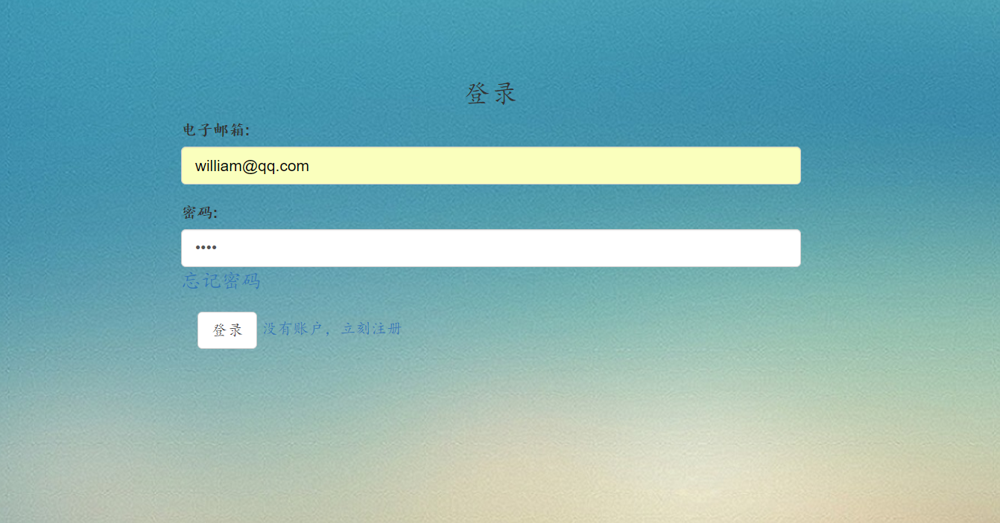
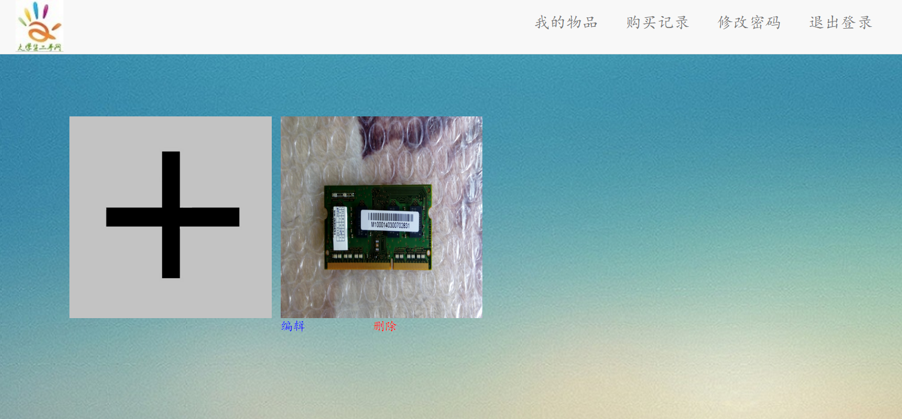
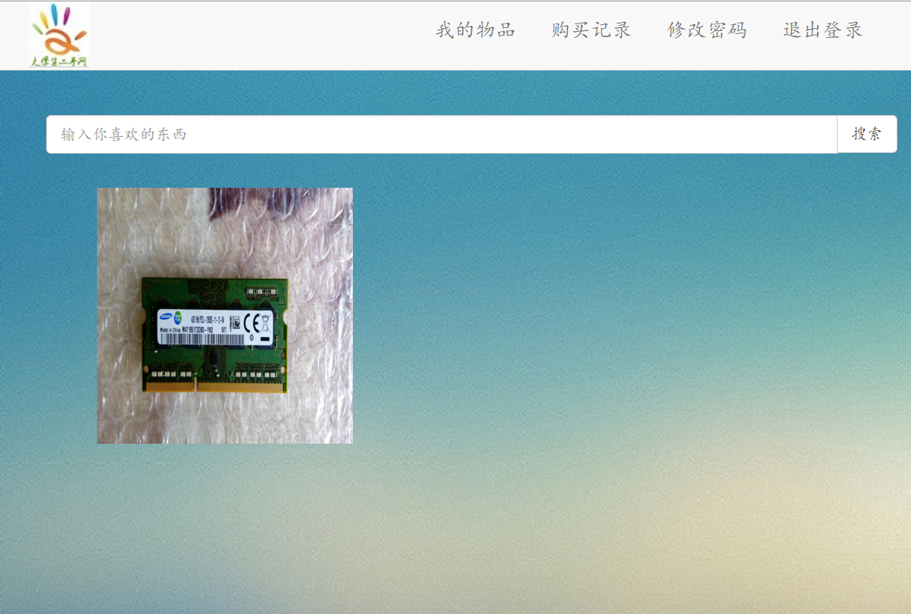
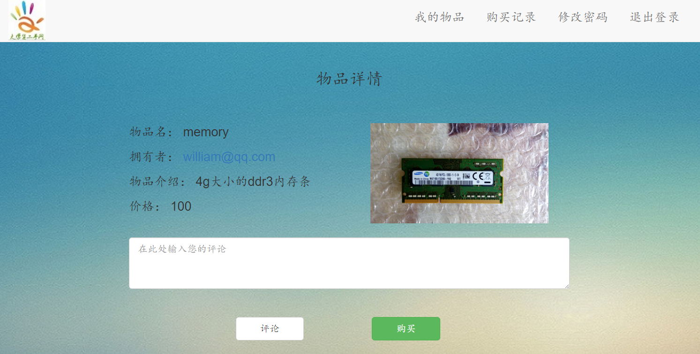
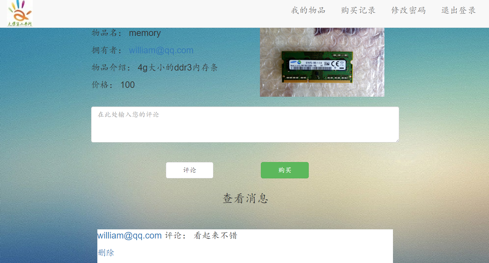
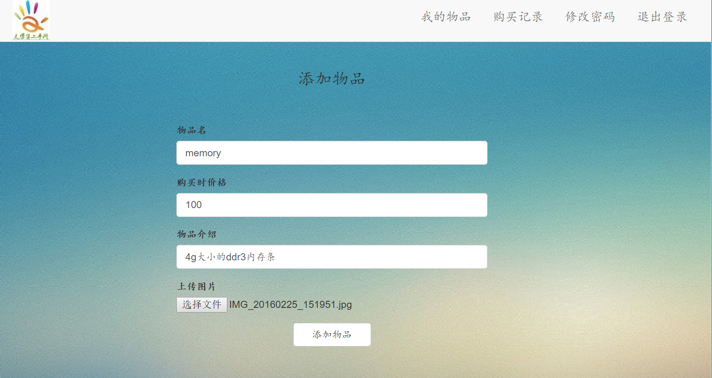
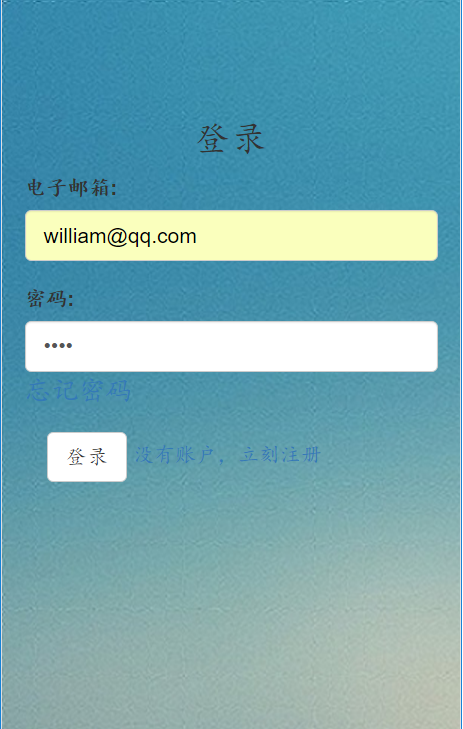

# Exchange
*二手物品交易平台*

在日常生活中，我们会有一些物品还没有报废但是却不想使用了，扔了太可惜，留着也用不上，于是这便给与了二手物品交易市场存在的空间，本项目立足于大学生群体，囊括大学生日常中的领域，该项目将会创造一个二手物品交易平台，用以满足人们的需求。
本平台二手物品涉及的范围包括各种小商品、签名册、纪念册、音像制品等等、（注：不包含奢侈品）。

在项目建立的过程中，参与的开发者同样也会学到很多实践经验，并且加深了对所学知识的认识。

###网站预览  

[网址](http://139.224.194.154:8080/Exchange/)

首页  

登录  

修改密码  

我的空间  

我的物品栏  

搜索结果    

物品信息  

评论物品  

交易记录  

添加物品  

响应式设计移动端  

###reframe
-----------------------
* <del>mysql for linux表名区分大小写，在dao层要设定小写字母 </del>
* <del>通用的增删改查</del>
* <del>在bean里设置primary key,使用ids去标记主键，这样每个表都继承带ids的父类bean Table</del>
* <del>action层一个类里面只有一个接口，这样做太浪费，融合相关的action.</del>
* <del>action与Biz是一一对应的，这样有必要封装开来吗？，判断返回值的代码也够多了。</del>
* <del>加注释</del>
* <del>时间不准</del>
* 图片没有独立出来，每次重新启动项目都会清空图片文件夹，尝试放在数据库里面。

